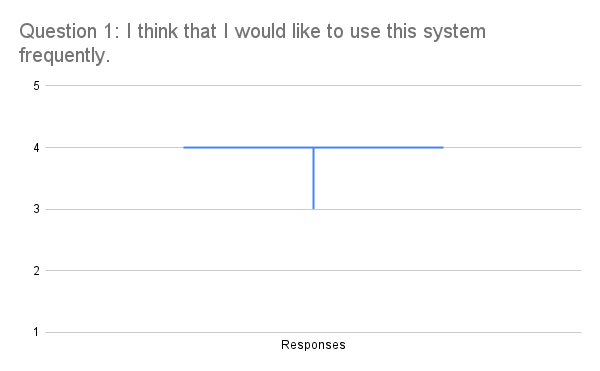
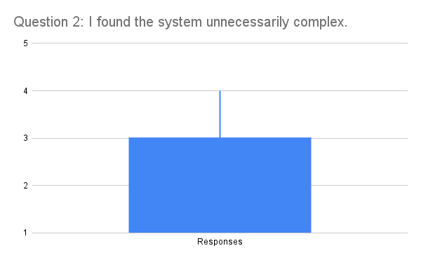
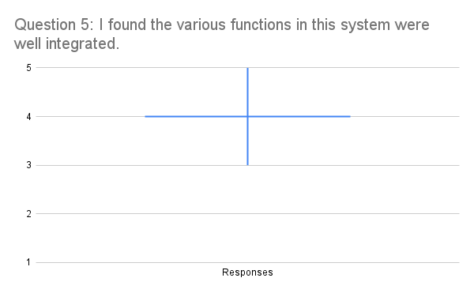

## Interesting things found from user testing
- User testers really liked our Widget menu, being able to customize the home screen made the user experience unique and adjustable, allowing us to cater to a wide variety of users.
- Over 75% of our testers rated our "I think that I would like to use this system regularly" question as a 4, meaning Agree, with everyone else answering 3, meaning neutral. 

## What was learnt from conducting user testing?

- Users have no attention span and will not scan the entire page. e.g putting the search bar at the bottom for touch hierarchy rather than the top made a few users spend a while to find the search bar.

## Most significant results found from user testing

- The most consistent user feedback is that stops and service icon in the services search page is not clearly differentiable. A fix could be to add text at the bottom of the icons to clearly state what the icon represents.

Some of the most significant results include those from question one and five. The majority of users who tested our design gave us the same result for these questions. For those who didn’t align with the majority's consensus, their result was only one degree of opinion away from the majority. These results were that most users agreed that they would use the system frequently and that the systems functions were well integrated, for question one and five respectively. 

------------------------------------------------------------------------------------------------------------------------------------------------------------
Experimentation Zone (remove later)

*Question 1: I think that I would like to use this system frequently*

*Question 2: I found the system unnecessarily complex*

*Question 3: I thought the system was easy to use*		

*Question 4: I think that I would need the support of a technical person to be able to use this system*

*Question 5: I found the various functions in this system were well integrated*

*Question 6: I thought there was too much inconsistency in this system*

*Question 7: I would imagine that most people would learn to use this system very quickly*

*Question 8: I found the system very cumbersome to use*	

*Question 9: I felt very confident using the system*

*Question 10: I needed to learn a lot of things before I could get going with this system*
