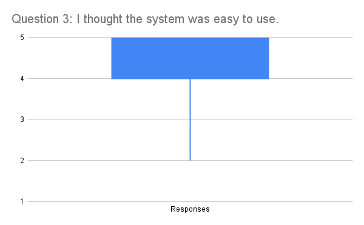
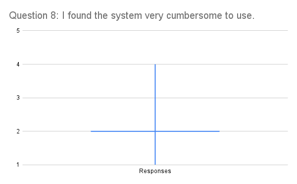
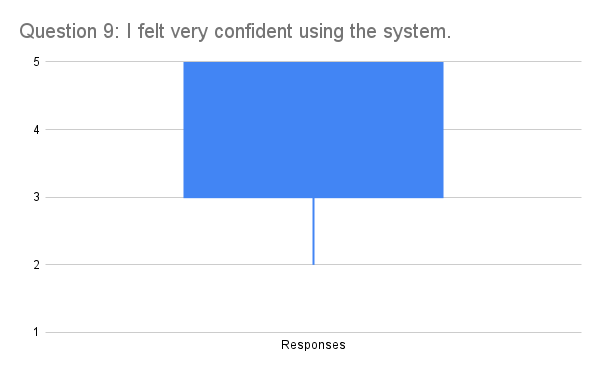

## Interesting things found from user testing
- User testers really liked our Widget menu, being able to customize the home screen made the user experience unique and adjustable, allowing us to cater to a wide variety of users.
- Over 75% of our testers rated our "I think that I would like to use this system regularly" question as a 4, meaning Agree, with everyone else answering 3, meaning neutral. 

## What was learnt from conducting user testing?

- Users have no attention span and will not scan the entire page. e.g putting the search bar at the bottom for touch hierarchy rather than the top made a few users spend a while to find the search bar.

## Most significant results found from user testing

- The most consistent user feedback is that stops and service icon in the services search page is not clearly differentiable. A fix could be to add text at the bottom of the icons to clearly state what the icon represents.

