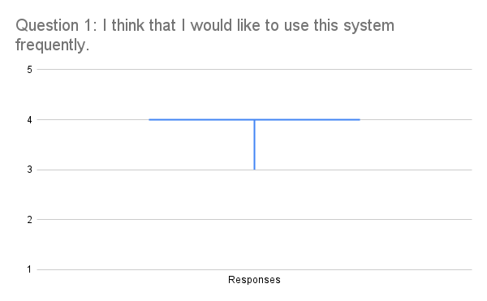

# Usability Test Results

## Quantitative Data

The following scores are calculated in adherence to the "Usability Goals" section details in our usability test plan. We received 13 responses in our testing, and the scores of each user in testing is listed below:

| Name         | Q1 | Q2 | Q3 | Q4 | Q5 | Q6 | Q7 | Q8 | Q9 | Q10 | Raw SUS | Final SUS |
|--------------|----|----|----|----|----|----|----|----|----|-----|---------|-----------|
| Robyn        | 3  | 2  | 4  | 4  | 4  | 1  | 3  | 3  | 2  | 2   | 24      | 60        |
| Tyler        | 4  | 2  | 4  | 2  | 5  | 1  | 4  | 2  | 5  | 1   | 34      | 85        |
| Roland       | 4  | 1  | 5  | 1  | 3  | 2  | 5  | 1  | 5  | 1   | 36      | 90        |
| Damon        | 3  | 3  | 3  | 2  | 4  | 3  | 4  | 2  | 3  | 2   | 25      | 62.5      |
| Ran          | 4  | 3  | 4  | 2  | 5  | 2  | 5  | 3  | 4  | 2   | 30      | 75        |
| Melissa      | 4  | 1  | 5  | 1  | 5  | 1  | 5  | 1  | 4  | 1   | 38      | 95        |
| Kade         | 4  | 2  | 5  | 1  | 4  | 1  | 4  | 2  | 5  | 1   | 35      | 87.5      |
| James Small  | 4  | 1  | 4  | 1  | 4  | 1  | 4  | 2  | 5  | 1   | 35      | 87.5      |
| Charlie      | 3  | 4  | 2  | 1  | 4  | 2  | 2  | 4  | 3  | 4   | 19      | 47.5      |
| Sekona       | 4  | 1  | 4  | 2  | 4  | 1  | 3  | 1  | 3  | 2   | 31      | 77.5      |
| Steven       | 4  | 3  | 5  | 3  | 4  | 2  | 5  | 2  | 5  | 4   | 29      | 72.5      |
| Eric         | 4  | 2  | 4  | 1  | 4  | 2  | 5  | 2  | 5  | 1   | 34      | 85        |
| Caleb        | 4  | 3  | 4  | 2  | 4  | 4  | 3  | 2  | 3  | 2   | 25      | 62.5      |

### Statistical Calculations Based on Data:
Average **'SUS'** score = 75.96
Median **'SUS'** score = 77.50
Standard Deviation of **'SUS'** score = 14.24
Range = 47.50 - 95

We received an average SUS score of 75.96. Following the Usability Test Plan (usabilityTestPlan.md), we are aiming for an optimal score of 75 and above and we have gotten that! For this reason, we can be confident our prototype doesn't have catastrophic usability issues, and we can focus on low to moderate usability fixes. 

The median score is slightly higher than the average, showing a few outliers with lower scores. Specifically, Charlie's score of 47.5. This supports that we have achieved the optimal score.

The standard deviation of 14.24 shows there is quite high variability in how others perceived the prototype. This could imply there is inconsistency in how others view the system.

# Graphs to visualise SUS score

# Qualitative Data:

> Alongside the SUS score questions, we asked general questions for each subject on their favourite features and suggested changes for the application. 

| Name        | Favorite Feature                                                                    | Suggested Changes                                                                                                                |
| ----------- | ----------------------------------------------------------------------------------- | -------------------------------------------------------------------------------------------------------------------------------- |
| Robyn       | I liked the adding widgets to the home screen.                                      | Things are a bit confusing to find. The icons that distinguish bus from train led to a lot of confusion. Make them more obvious. |
| Tyler       | Widgets on the home screen; easily get information and customize preferences.       | Naming conventions in search boxes were confusing (prototype limitation).                                                        |
| Roland      | Widgets, allowing for easy customisation of the home screen.                        | Some settings relate to Route Planning feature; relocate them.                                                                   |
| Damon       | Settings menu                                                                       | Fine tune the route planning process.                                                                                            |
| Ran         | Setting page very clean and straightforward.                                        | Change back button behavior to go to original page, not last step.                                                               |
| Melissa     | Adding specific widgets; services timetables on saved favorite routes.              | More information on the chosen route.                                                                                            |
| Kade        | The ease of saving routes.                                                          | Add filtering for search options.                                                                                                |
| James Small | Alert system; good addition despite some cohesion issues with bus and train alerts. | Clarify “add” button is for widgets, and better spacing for mixed bus/train info.                                                |
| Charlie     | Widgets are a very nice feature.                                                    | Map view of the current route was confusing and could be improved.                                                               |
| Sekona      | Simplicity of completing tasks.                                                     | More feedback during steps—e.g., clearer route search confirmation.                                                              |
| Steven      | *(No entry)*                                                                        | *(No entry)*                                                                                                                     |
| Eric        | Widget                                                                              | *(No entry)*                                                                                                                     |
| Caleb       | Widgets in main menu were helpful.                                                  | Move settings icon to bottom bar; improve visual feedback for page location and search bar placement.                            |
### Main Favourite Features:
- Widgets: 8 subjects praised the widget system.
- Alerts: 1 subjects praised the alerts page.
- Settings: 2 subjects praised the settings page.
### Main Suggestions for Improvement:
* Search and filtering, specifically visual hierarchy and naming: 4 subjects.
* Feedback and confirmation, specifically in widget creation, search and settings: 2 subjects.
* Clearer icons and labels: 2 subjects.

# All Issues Classified

> Next to the title of each issue, is the issue number that it correlates to.

## No approximation of units on sliding scales (#39). 
Description: In usability testing, we found subjects were confused in the settings on setting their "walking speed". They commented that they didn't know their own walking speed in reference to the scale because it wasn't labeled.

Students: Roland, Steven, Eric.

From our definition of "Moderate", this was a noticeable issue because it confused the user, blocking task completion. A few of them couldn't set their walking speed because they had no clue where they would be on the scale.

Classification: Moderate

## Vague headings in Settings modal (#40)
Description: In usability testing, there was a subject who found the details in each Setting container unhelpful. They were simple titles and he thought they could've used more documentation to help him understand.

Students: James

From our definition of "Minor", this was a low-impact issue because it caused a small inconvenience. This was only a minor confusion on semantics. Only one subject experienced this, and it did not affect the user's ability to complete the task. Therefore "Minor" is most appropriate.

Classification: Minor

## The widget creation menu doesn't give enough detail. (#38)
Description: In usability testing, we found two subjects who thought the widget creation was vague and provided few hints to guide the user. For example, indicating that the (+) icon provided no reference that it was adding a widget, instead just adding "something". 

Students: Roland, James, Sekona. 

From our definition of "Minor", this is a low-impact issue because it was a small inconvenience to the subject. They had quickly understood the (+) button after experimenting, and it occurred infrequently, appearing on only 2/13 subjects.

Classification: Minor

## Have more ways to exit out of the widget creation menu. (#37)
Description: In usability testing, we found users not seeing the (x) icon to close the widget creation screen. This had been missed. From viewing their actions, they had tried clicking in a blank space to close it (like a modal) but that didn't work. They had quickly seen the (x) icon after scanning the page, but this was noted. 

Students: Roland and Sekona. 

From our definition of "Minor", this is a low-impact issue because it was a small inconvenience to the subject. They had quickly found the (x) button, and it occured infrequently, appearing on only 2/13 subjects.

Classification: Minor

## Buses and trains aren't organised in the services menu. (#35)
Description: During usability testing, some test participants reported that combining both bus and train services into a single, undifferentiated list on the services home page made navigation more difficult. The lack of categorisation requires users to scan through a mixed list of services to find the specific transport mode they are looking for, which can increase cognitive load and reduce efficiency.

Students: Tyler, Roland, James

While the current design is functional and all services remain accessible, the issue presents a mild inconvenience rather than a critical usability flaw. The problem only emerged for one user and does not prevent users from completing tasks. However, addressing it could lead to a modest improvement in user satisfaction and navigation efficiency for multi-modal transport users.

Classification: Minor

## Differentiate train and bus stops services better in the search. (#28 and #34)
Description: Across all usability test sessions, users consistently reported confusion when using the services search and viewing the services home page. Specifically, users were unable to easily distinguish between transport services (e.g., "Bus 32") and stops or stations (e.g., "Victoria Station"). The current interface presents both types of results in a visually identical or overly similar format, leading users to mistakenly select the wrong type of result or hesitate before making a selection.

Students: Tyler, Ranju, Damon, Kude, Melissa, Charlie, Steven, Eric, Caleb, Roland, James. 

This issue affects all users and was raised consistently by every test participant, indicating it’s a widespread usability concern. While it does not prevent users from completing their tasks, it introduces hesitation, increases the chance of incorrect selection, and adds cognitive friction to a core functionality of the app. Addressing it would provide a significant improvement in clarity and user experience without requiring a major redesign.

Classification: Moderate

## Keep search bars at top (#33)
Description: Multiple usability test participants failed to notice the search bar positioned at the bottom of the screen. When trying to perform a search, users instinctively scanned the top portion of the interface, as this is the conventional location for search inputs in most mobile apps. As a result, some users either assumed there was no search functionality or took longer than necessary to locate it.

Students: Caleb.

While the search bar is technically present and functional, its unexpected position leads to confusion and delays for a significant number of users. The issue does not block task completion but introduces unnecessary friction and reduces user efficiency. Aligning with standard design conventions would offer a meaningful improvement to the overall user experience.

Classification: Moderate

## Give alerts tiles a way to expand them for more information (#31)
Description: In usability testing, there were two subjects who wanted more information from the alerts. The alerts currently provide short detail on things like bus replacements, service cancellations, but these subjects required more.

Students: Roland, Sekona.

Classification: Moderate

## Remove widgets from the add menu when they're already added (#27 and #30)
Description: Based on user testing, we identified that the current design allows users to attempt to add widgets that are already present on the home page. This caused confusion, as users clicked the "Add" button on widgets they had already added, expecting a new action or feedback, but nothing happened.

Students: Tyler, Ranju, Roland, James, Charlie, Eric, Caleb. 

The issue impacted user expectations and caused confusion, which could reduce satisfaction and lead to a perception of the app as buggy or incomplete.

Classification: Moderate.

## Make favourites area more visible to the user (#29)
Description: In usability testing, we found subjects who overlooked the favourite star during testing due to low contrast. To fix this issue, the group member must:

Students: Caleb

Classification: Minor

## Allow Typing input for Search Menus (#26)
Description: In usability testing, there were many subjects who tried to insert text in the prototype in to the search menu. This wasn't implemented in the prototype due to limitations in Figma.

Students: No exact student noted, but we found many tried to do this in the session.

Classification: Severe

