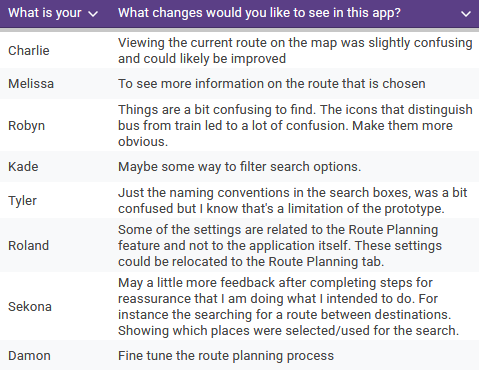

## Section 1: Interesting things found from user testing

Users overwhelmingly felt confident in their use of the app, and found it to not be complex or hard to use. However, this was a sentiment held to widely varying degrees (with many being neutral on these topics). This spread is most apparent in the answers to questions 2, 7, and 9. It is also present in other questions, but to a lesser degree, with more positive and fewer neutral results.

These questions focus on the common theme of the users ability to use the app and the results show that the use of our app is very intuitive to some users, but only mildly intuitive or neutral to others. This may be a result of some convenient but unconventional layout choices (discussed in section 2), or the specific limitations/inconsistency of the prototype (discussed in section 3). This result has some interesting implications for our app's widespread appeal, and whether it is geared a little too much toward a specific type of user.

## Section 2: What was learnt from conducting user testing?

Users scanned from top to bottom of each page as expected, but this sometimes meant missing items closer to the bottom. The best example of this was that putting the search bar at the bottom rather than the top for touch hierarchy made a few users take a while to find it. Interestingly, this was reflected only in the Recorder's notes from testing, and not at all in user feedback. Users consistently said they did not find the system cumbersome to use, and there was only one piece of written feedback saying the placement of these elements was confusing.

This may mean that this slow first-time finding of elements on the bottom of the screen was a lower priority for most users than we expected. It may also be a limitation of the survey, as any momentary frustration at this would not be remembered by the end of the test. This could be solved by asking specific questions about the time taken to find UI elements, either at the end of the SUS survey or after the relevant tasks.

## Section 3: Most significant results found from user testing

It is clear that the route planning page currently has the biggest pain points in our app, as 8 out of the 13 test subjects reported some issue with the page. This appears to be due to a mix of multiple factors, such as the placeholder names/icons of search results, the limited interactivity of text entry, and the fixed map display.

The development of these areas was clearly not prioritised enough, especially when compared to the other pages. As such, improvements to the route planning page should be a very high priority for future development. These should include more intuitive text entry and result filtering, better feedback to the user on what type of result they are selecting, and more information on the map and the results view.

Some of the most significant results include those from question one and five. The majority of users who tested our design gave us the same result for these questions. For those who didn’t align with the majority's consensus, their result was only one degree of opinion away from the majority. These results were that most users agreed that they would use the system frequently and that the systems functions were well integrated, for question one and five respectively. 

Question eight also has very consistent results from our users, but with slightly further outliers than that of question one and five. The majority of users disagreed with the notion that the system is very cumbersome to use, with outliers either agreeing or strongly disagreeing with the notion. 

For the users favourite feature of the app, there is a clear appreciation for the widget feature on the home page. Out of the twelve responses to this question, seven of them are about the widget feature. 

Some of the more detailed responses give further justification for their decision, including:
- “\[making] it easier to perform certain tasks or have information that’s relevant to me.”
- “\[providing] a very good way for users to quickly and easily get information, and customize to their preferences.”
- “allowing for easy customisation of the home screen to things one needs.”
Breaking these results down into the abstract aspects that they represent tells us that what makes the widgets their favourite feature is because of its “Shortcuts”, “Relevant information” and “Customizability”. We can then consider the other features of our app and whether they have some of these qualities or if they lack them. In the latter case of a feature lacking these aspects, we can consider how they could be added and whether these changes would be detrimental. 

---------------------------------------------------------------------------------------------------------------------------------------------------
Experimentation Zone (remove later)

Interesting : Varied results		2, 7, 9
Learnt : Text results				
	Positive: Widgets (overwhelmingly), Settings menu, Favourites system, Overall simplicity
	Negative: Search boxes, improved route planning (train/bus icons, filters, etc. overwhelmingly!)
Significant : Consistent results	1, 5, 8

*Question 1: I think that I would like to use this system frequently*

*Question 2: I found the system unnecessarily complex*

*Question 3: I thought the system was easy to use*		

*Question 4: I think that I would need the support of a technical person to be able to use this system*

*Question 5: I found the various functions in this system were well integrated*

*Question 6: I thought there was too much inconsistency in this system*

*Question 7: I would imagine that most people would learn to use this system very quickly*

*Question 8: I found the system very cumbersome to use*	

*Question 9: I felt very confident using the system*

*Question 10: I needed to learn a lot of things before I could get going with this system*
